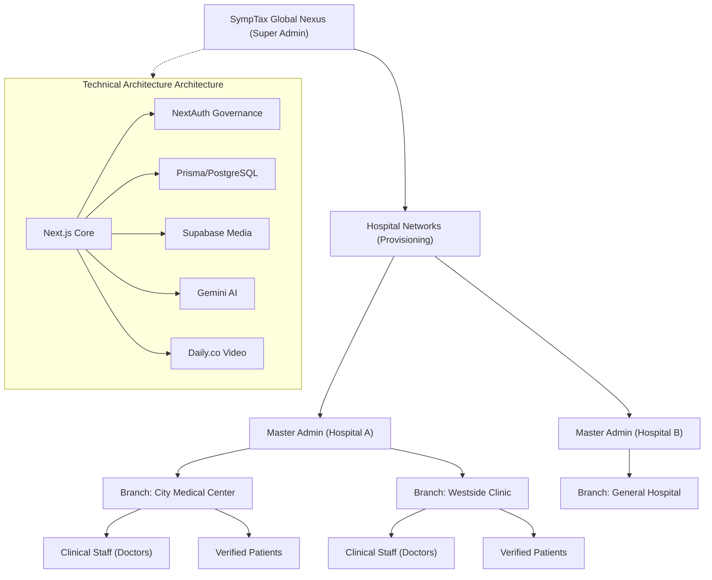

# SympTax: Advanced Ledger & Analytics (ALA)

## System Architecture Hierarchy (Branching Format)

---

## The Vision: Why SympTax Was Created

### The Paradox of Modern Healthcare
In an era where technology has seamlessly integrated into almost every facet of our daily lives, healthcare remains paradoxically fragmented. Patients often find themselves as "data nomads," carrying physical records or repeating their medical histories to every new clinician they encounter. Conversely, hospitals often operate as digital islands, where critical data is trapped behind proprietary siloes or inefficient branch management structures.

SympTax was created to bridge this divide. It is not merely a record-keeping tool; it is a **Digital Clinical Nexus** designed to unify the scattered elements of the medical journey into a cohesive, secure, and intelligent ecosystem.

### Purpose: Empowering through Transparency
The primary purpose of SympTax is to restore **agency** to the patient while providing **infrastructure** to the clinician. By leveraging a multi-tenant architecture, the platform allows for a hierarchical "Hospital-Branch" system. This ensures that a patient's data is consistent across an entire hospital network, while the Super Admin and Master Admin roles ensure that every clinical participant is verified and trustworthy.

### The Role of Intelligence
Beyond storage, SympTax introduces the **Clinical AI Assistant**. In a world of over-abundance of data, we realized that "more data" often leads to "more confusion." Our integrated AI doesn't just store records; it helps sift through them to provide wellness insights, symptom guidance, and patterns that might otherwise be missed. This is governance through intelligence—making the data work for the patient, not the other way around.

### A Secure Future
SympTax is built on the principle of **Zero-Approximation Security**. Every user role is gated, every medical file is isolated in private cloud storage, and every registration is manually vetted by administrators. We believe that digital health can only succeed if the foundation of trust is unbreakable. SympTax is our blueprint for that future—a simplified, secure, and smart ledger for the most important asset any human owns: their health.
